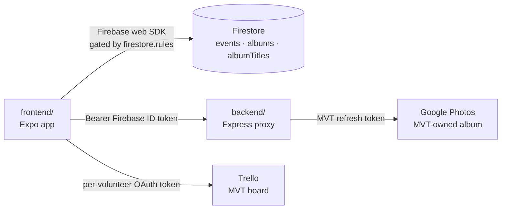
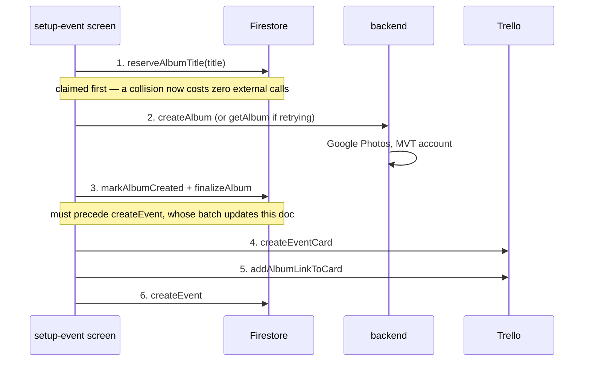

# Architecture

The flows that cross package boundaries. Per-package detail lives in
[../frontend/CLAUDE.md](../frontend/CLAUDE.md),
[../backend/CLAUDE.md](../backend/CLAUDE.md) and
[../firestore/CLAUDE.md](../firestore/CLAUDE.md).

## The systems



Firestore and Trello are reached **directly from the device**. Google Photos never
is — that indirection is the reason `backend/` exists.

## Sign-in and roles

Volunteers sign in with Google through Firebase Auth.
[frontend/auth/auth-context.tsx](../frontend/auth/auth-context.tsx) holds the
single app-wide subscription; `user` is `undefined` while initializing, `null`
when signed out, a `User` when signed in.

There is exactly one role, carried as the Firebase custom claim `admin`:

```bash
cd backend && npm run set-admin -- you@example.com
```

**The claim only reaches the app when a new ID token is minted**, and tokens are
cached for up to an hour. Signing out and back in is a required step, not a
suggestion. `useIsAdmin()` reads the cached token first and force-refreshes only
when it reports non-admin.

Admins can create events, create albums, and view the albums screen. Everything
else is open to any signed-in volunteer, and the boundary is enforced in
[firestore.rules](../firestore.rules) — never client-side.

## Event setup is a saga

Creating an event writes to three systems that have no shared transaction. A
failure partway used to leave orphans behind, and — worst of all — an orphaned
album record permanently blocked ever reusing that title.

[frontend/services/event-setup.ts](../frontend/services/event-setup.ts) now runs
each step with a registered undo, unwinding in reverse on failure.



Two design points worth keeping:

- **The title is claimed before anything external happens.** A duplicate title
  fails immediately instead of after creating a Google album and a Trello card.
- **A retry reuses the album from a failed attempt** rather than creating a second
  one, because the Google Photos API has no album-delete endpoint. The reservation
  carries `existingAlbumId` for exactly this.

When unwinding cannot fully succeed, `EventSetupError.residue` carries what was
left behind and is appended to the user-facing message — a partial failure is
never silent.

## Event lifecycle

```
admin creates          volunteer claims        volunteer works        stop           publish
  (unstarted)     →      (startedBy set)   →    (metrics, photos)  →  (ended)   →   (published)
```

| Transition | Writes | Gated by |
|---|---|---|
| create | `createdBy`, all start/end fields null | admin only |
| claim | `startDate`, `startedBy`, `isActive` | any signed-in user, **only if unclaimed** |
| running | `metrics`, `notes` | admin or `startedBy` |
| end | `isActive: false`, `endDate` | admin or `startedBy` |
| draft | `isDraft`, `savedAsDraftAt` | admin or `startedBy` |
| publish | `isDraft: false`, `publishedAt` | admin or `startedBy` |

`endDate` is written **exactly once**, when the event ends. `saveDraft` and
`publishEvent` must never touch it — otherwise re-saving a draft days later
inflates `hoursOfService`, which is derived as `endDate - startDate` and never
stored. A test in `services/__tests__/event-service.test.ts` pins this.

Events are never deletable, by anyone, by rule.

`notepad` was merged into `notes` on `main` and no longer exists on the `Event`
type, but it survives in the `firestore.rules` update allowlist. That is harmless —
an allowed key nothing writes — so it stays until someone confirms no deployed
build still sends it.

If the app is killed mid-event, [frontend/app/_layout.tsx](../frontend/app/_layout.tsx)
calls `getActiveEvent()` once per sign-in and offers to resume. That query is
scoped to `startedBy == currentUser.uid`, so nobody is ever dropped into someone
else's event.

## Photo pipeline

The flow the project exists for. Capture must never block on the network —
volunteers work in spotty riverside coverage — so photos are persisted locally
first and uploaded opportunistically.


- **Queue** — [frontend/services/photo-queue.ts](../frontend/services/photo-queue.ts).
  Photo ids are deterministic (`${eventId}:${issueId}:${slot}`), so retaking a
  photo replaces the entry instead of accumulating duplicates. Status is
  `pending | uploaded | failed`; failures stay queued and are retryable.
- **Opportunistic flush** — `flushInBackground(eventId)` fires after a capture in
  [frontend/app/camera-view.tsx](../frontend/app/camera-view.tsx).
- **Blocking flush** — `handleStop()` in
  [frontend/app/trail-document-screen.tsx](../frontend/app/trail-document-screen.tsx)
  awaits `flush()` before the summary appears, so an event does not end with
  photos still stranded on the device.
- **Upload** — `POST /api/upload` uploads with bounded concurrency 4, then issues
  one `batchCreate`. It answers `201` (all), `207` (partial, casualties named in
  `failed[]`), or `502` (none — `batchCreate` skipped). One bad photo never
  strands the rest.

## Album title uniqueness

Album titles must be unique, case- and whitespace-insensitively, forever. The
mechanism is a deterministic document id in `albumTitles`:

```
"Spring Cleanup " → normalize → "spring cleanup" → encode → "t_spring%20cleanup"
```

Because the id is derived from the title, a duplicate is a document-id collision —
atomic, with no read-then-write race. A `pending` reservation can be released; a
`created` one is permanent.

The same function is implemented **twice**, in
[frontend/services/album-service.ts](../frontend/services/album-service.ts) and
[backend/src/album-title-key.ts](../backend/src/album-title-key.ts), pinned to the
shared vectors in
[album-title-test-vectors.json](../album-title-test-vectors.json). Change one and
you must change the other.

## Publish ordering

In [frontend/app/edit-draft.tsx](../frontend/app/edit-draft.tsx), publishing runs
**Trello first, Firestore last**:

1. `moveCardToCompleted(...)`
2. `moveCardAttachmentsToCompleted(...)`
3. `publishEvent(eventId)`

If a Trello call fails, the event is still `isDraft: true` and still visible in
Drafts, so the volunteer can retry. The reverse order — which this replaced —
flipped Firestore first, so a Trello failure left an event published in the app,
gone from Drafts, and never moved on the board, with no way to retry from the UI.

The same reasoning applies anywhere else you sequence a multi-system write: **make
the recoverable, externally-visible step first and the local state flip last.**
